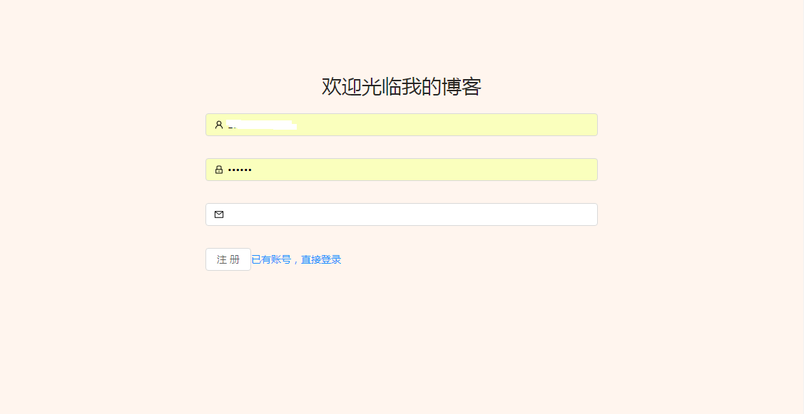
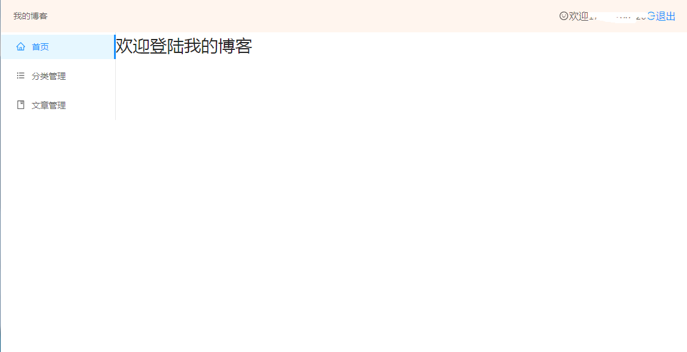

# 一个博客全栈项目

## 前端 react +antedesign

## 后端 egg 框架

## 数据库 mongodb

## 启动：

* 1.启动数据库：mongod --config D:\MongoDB\etc\mongodb.conf
* 2.启动服务：npm run dev
* 3.启动前端: npm run dev

## 思路：
- 1.两个路由/和/admin分别为登录界面和内容界面，用react中路由去控制
-2.

### http://localhost:3000/#/

### http://localhost:3000/#/admin

